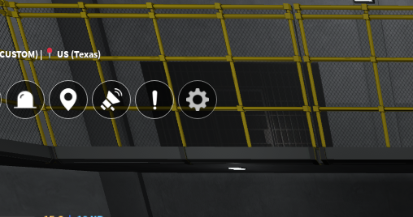
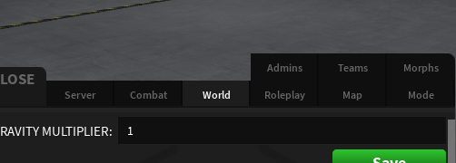
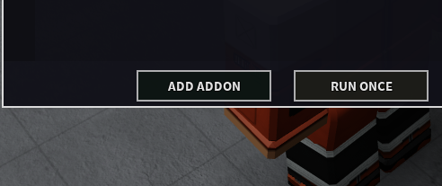
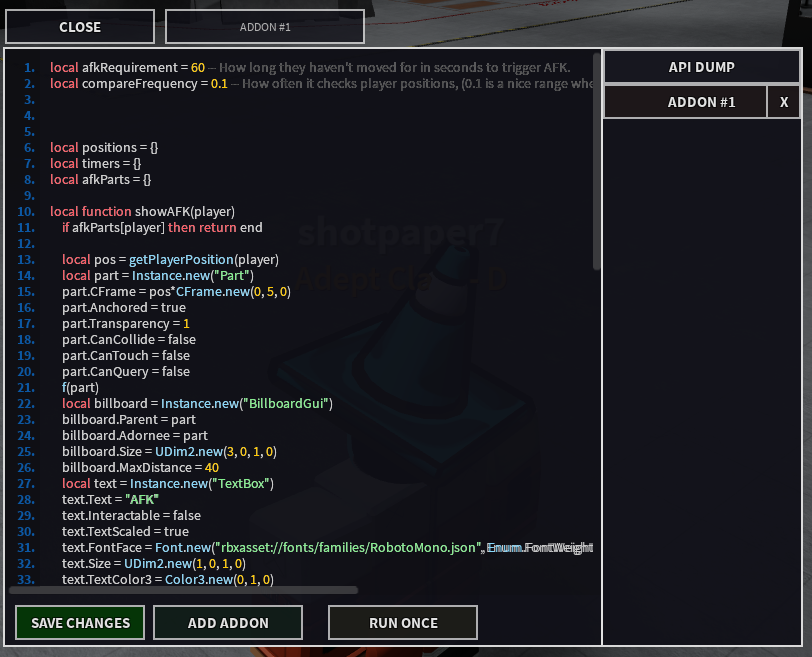
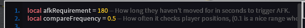

# Welcome!
---
## Introduction
This section of the documentation will give you a short little guide on what addons are and how to use them!

This is designed to be an improved version of the SCP:RP Addon Documentation.

Please note that this is a passion project, maintained by [The Aquifer](https://discord.gg/xAU96USgBv) and any support would be appreciated.
You can find the pages on the left and the table of contents on the right.

To find the documentation with SCP:RP functions, please enter the "SCP:RP Functions" page on the left.

---
## How to use an addon
#### Step 1:
In your custom server, open the server settings menu from the top left. It should appear as a cog icon as shown in the image below.

---
#### Step 2:
In the server settings menu, you now need to go to the "World" tab. You can see it in the image below.

---
#### Step 3:
In the World tab, you need to scroll down to the bottom, to find the Server Addons menu.

---
#### Step 4:
In the Server Addons menu, press "ADD ADDON".

---
#### Step 5:
Paste your chosen addon into the box.

---
#### Step 6:
Change any configuration values the script provides. These are often found at the top of the script.

---
#### Step 7:
Press "SAVE CHANGES" at the bottom of the menu.

And done! Your addon should work as intended. If you have any issues, such as an error appearing in the bottom right of your screen, we recommend getting help from either the script creator or someone from our [server](https://discord.gg/xAU96USgBv)!